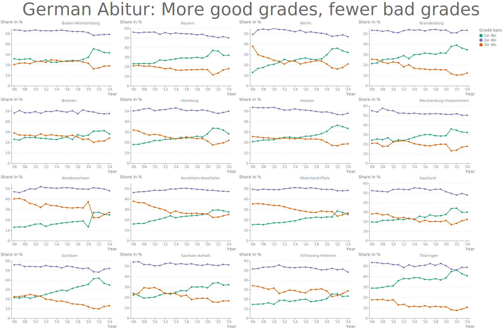
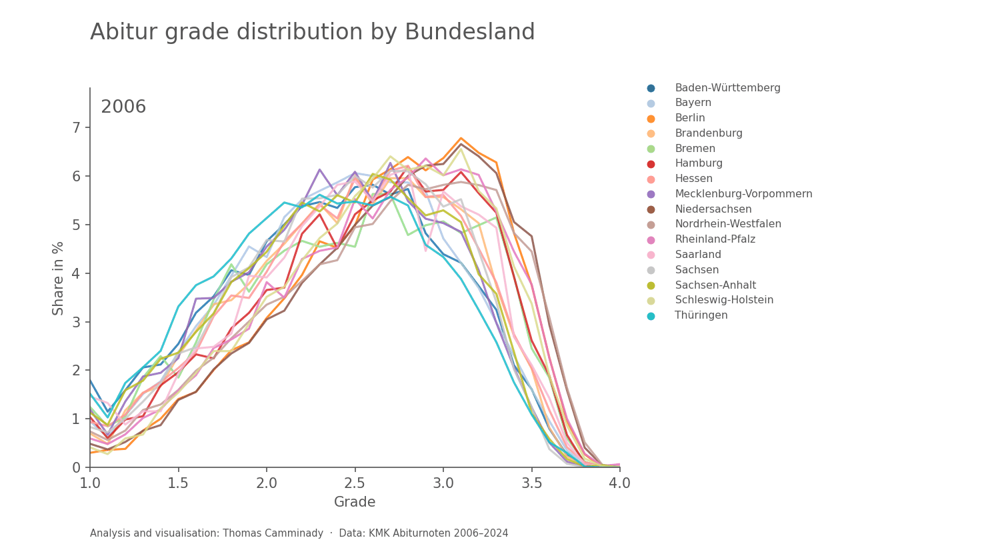

# German Abitur: More good grades, fewer bad grades

The **Abitur** is the German high-school diploma required for university admission. Grades run from **1.0** (best) to **4.0** (worst passing grade) in steps of 0.1. A **1er Abi** summarizes the 1.x grades, a **2er Abi** the 2.x grades, and so on. 

The chart shows the share of Abitur graduates in each of the 16 German states (*Bundesländer*) that fell into each grade band, from 2006 to 2024.

The animation below shows the full grade distribution (1.0–4.0) for each state, one year at a time.

Data: [Kultusministerkonferenz (KMK)](https://www.kmk.org/dokumentation-statistik/statistik/schulstatistik/abiturnoten.html). Abiturnoten 2006-2024.

Source code on [GitHub](https://github.com/thomascamminady/abiturnoten).
