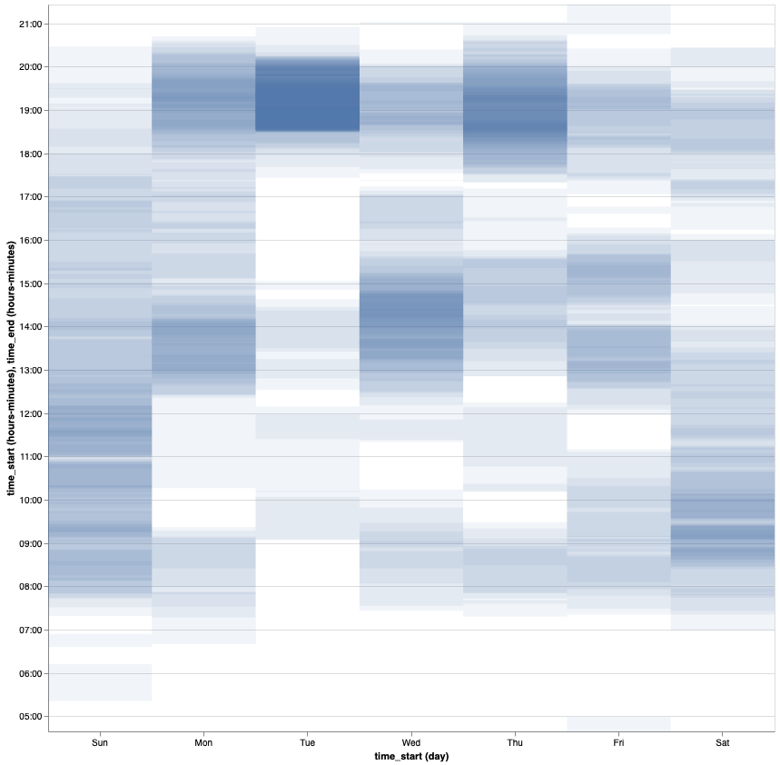

<script data-goatcounter="https://drtc.goatcounter.com/count" async src="//gc.zgo.at/count.js"></script>

# Storytelling with my personal running data

This is just an undocumented of (in my mind) interesting ways to visualize my personal running data.

```js
import * as aq from "npm:arquero";

const data = FileAttachment("../data/running.json").json();
const activities = FileAttachment("../data/runalyze-activities-2.csv").csv();
const aqactivities = FileAttachment("../data/runalyze-activities-2.csv").arquero();
const config = {
    width: 500,
    height: 300,
    marginLeft: 50,
    marginTop: 20,

};
```

```js
aq.addFunction('getYear', timestamp => {
  return new Date(timestamp * 1000).getUTCFullYear();
});

aq.addFunction('getMonth', timestamp => {
  return new Date(timestamp * 1000).getUTCMonth();
});

aq.addFunction('getDay', timestamp => {
  return new Date(timestamp * 1000).getUTCDay();
});

aq.addFunction('getDayOfMonth', timestamp => {
  return new Date(timestamp * 1000).getUTCDate();
});

aq.addFunction('getHour', timestamp => {
  return new Date(timestamp * 1000).getUTCHours();
});

aq.addFunction('getDate', timestamp => {
  return new Date(timestamp * 1000);
});

Date.prototype.getUTCWeekNumber = function () {

    const date = new Date(Date.UTC(this.getUTCFullYear(), this.getUTCMonth(), this.getUTCDate()));
    // Set to the nearest Thursday: current date + 4 - current day number
    // Make Sunday (0) act like it's 7
    const dayNum = date.getUTCDay() || 7;
    date.setUTCDate(date.getUTCDate() + 4 - dayNum);

    // Get the first day of the year
    const yearStart = new Date(Date.UTC(date.getUTCFullYear(), 0, 1));

    // Calculate full weeks between the year start and the adjusted date
    return Math.ceil(((date - yearStart) / 86400000 + 1) / 7);

};

aq.addFunction('getWeek', timestamp => {
  return new Date(timestamp * 1000).getUTCWeekNumber();
});

```

## Calendar view

```js
Plot.plot({

    width:800,
    height:200,
    color:{legend:true,scheme:"Blues"},

marks: [

        Plot.dot(
            (aqactivities
            .derive({
                year: d => aq.fn.getYear(d.time),
                month: d => aq.fn.getMonth(d.time),
                day: d => (aq.fn.getDay(d.time)-1+7)%7,
                hour: d => aq.fn.getHour(d.time),
                dom : d=> aq.fn.getDayOfMonth(d.time),
                week: d=> aq.fn.getWeek(d.time)
                })
            .filter((d)=>d.sportid==168070)
            .filter((d)=>d.distance < 45)
            .filter((d)=>d.year==2024)
            .groupby("day","week")
            .rollup({total:aq.op.sum("distance")})
            ),
            {
                    x: "week",
                    y: "day",
                    fill:"total",
                    r:"total",
                })

]})

```

## Monthly aggregate

```js
Plot.plot({
marks: [

        Plot.barY(
            (aqactivities
            .filter((d)=>d.sportid==168070)
            .filter((d)=>d.distance < 45)
            .derive({ year: d => aq.fn.getYear(d.time) })
            .derive({ month: d => aq.fn.getMonth(d.time)+1 })
            .filter((d)=>d.year==2024)
            .select("month","distance")
            .groupby("month")
            .rollup({total:aq.op.sum("distance")})
            .orderby("month")),
            {
                    x: "month",
                    y: "total"
                })

]})

```

## Cumulative distance & elevation gain

```js
Plot.plot({
    ...config,
    x: {
        type: "utc"
    },
    y: {
        grid: true,
        label: "Total distance (kilometers)"
    },
    color: {
        type: "categorical"

    },
    marks: [
        Plot.lineY(data.filter((d) => d.year == 2024), {
            x: "date",
            y: "total_distance"
        }),
        Plot.tip([`Two week trip to India`], {
            x: new Date("2024-02-18"),
            y: 700,
            dy: 4,
            dx: 0,
            anchor: "top-left",
            textPadding: 5,
            pointerSize: 6
        }),

        Plot.tip([`Moving week`], {
            x: new Date("2024-09-13"),
            y: 3500,
            dy: -4,
            dx: 0,
            anchor: "bottom-right",
            textPadding: 5,
            pointerSize: 6
        }),

        Plot.tip([`Sick`], {
            x: new Date("2024-10-05"),
            y: 3750,
            dy: 4,
            dx: 0,
            anchor: "top-left",
            textPadding: 5,
            pointerSize: 6
        }),

        Plot.tip([`Sick again`], {
            x: new Date("2024-11-11"),
            y: 4100,
            dy: 4,
            dx: 0,
            anchor: "top-left",
            textPadding: 5,
            pointerSize: 6
        }),

        Plot.axisY({
            tickSize: 0,
            dx: 10,
            dy: -7
        }),
        Plot.axisX({
            tickSize: 0,
            ticks: 10
        })

    ]
})
```

And here is the historic view over the last decade.

```js
Plot.plot({
    ...config,
    x: {
        type: "utc"
    },
    y: {
        grid: true,
        label: "Total distance (kilometers)"
    },
    color: {
        type: "categorical"
    },
    marks: [
        Plot.lineY(data, {
            x: "date",
            y: "total_distance",
            stroke: "black",
            z: "year"
        }),
        Plot.axisY({
            tickSize: 0,
            dx: 10,
            dy: -7
        }),
        Plot.axisX({
            tickSize: 0,
            ticks: 10
        })

    ]
})
```

Here's the same chart, but for elevation gain.

```js
Plot.plot({
    ...config,
    x: {
        type: "utc"
    },
    y: {
        grid: true,
        label: "Total elevation gain (meters)"
    },
    color: {
        type: "categorical"
    },
    marks: [
        Plot.lineY(data.filter((d) => d.year == 2024), {
            x: "date",
            y: "total_elevation",
            tip: true,
            stroke: (d) => d.total_elevation < 56000 ? "green" : "blue"

        }),
        Plot.tip([`Hilly, mountainous region with lots of forest`], {
            x: new Date("2024-05-13"),
            y: 27000,
            dy: 4,
            dx: 0,
            anchor: "top-left",
            textPadding: 5,
            pointerSize: 6,
            stroke: "green",
        }),
        Plot.tip([`Flat region along a river`], {
            x: new Date("2024-10-15"),
            y: 62000,
            dy: 4,
            dx: 0,
            anchor: "bottom-right",
            textPadding: 5,
            pointerSize: 6,
            stroke: "blue"
        }),

        Plot.axisY({
            tickSize: 0,
            dx: 10,
            dy: -7
        }),
        Plot.axisX({
            tickSize: 0,
            ticks: 10
        })

    ]
})
```

Here again the historic view.

```js
Plot.plot({
    ...config,
    x: {
        type: "utc"
    },
    y: {
        grid: true,
        label: "Total elevation gain (meters)"
    },
    color: {
        type: "categorical"
    },
    marks: [
        Plot.lineY(data, {
            x: "date",
            y: "total_elevation",
            stroke: "black",
            z: "year"
        }),
        Plot.axisY({
            tickSize: 0,
            dx: 10,
            dy: -7
        }),
        Plot.axisX({
            tickSize: 0,
            ticks: 10
        })

    ]
})
```

## Distance distribution

```js
Plot.plot({
  width:700,
  fy: {padding: 0.3},
  color: {legend: false, type:"ordinal", scheme:"Observable10"},
  marks: [

    Plot.tickX(activities.filter((d)=>d.sportid==168070).filter((d)=>d.distance < 43).filter((d)=>d.s<4*3600).filter((d)=>d.s/60 / (d.distance)>2).filter((d)=>d.s/60 / (d.distance)<7).filter((d) =>  new Date(1000*d.time).getUTCFullYear()>=2014),
        {
        x:(d)=>d.s/60 / (d.distance),
             fy:(d) =>  new Date(1000*d.time).getUTCFullYear(),
             opacity: "distance",
             strokeWidth:1

    }),


  ]
})

```

## Timetable


